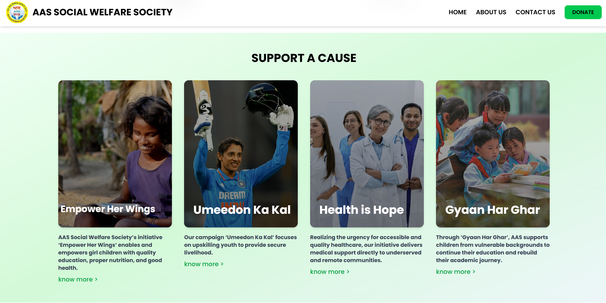

# AAS Social Welfare Society


 
 


**Live Demo:** https://aas-social-welfare-society.vercel.app/

## 📖 About The Project

This is the official digital presence for **AAS Social Welfare Society**, a Non-Governmental Organization (NGO) dedicated to social upliftment and community support.

As the lead frontend engineer for this initiative, I built a highly optimized, responsive, and accessible web platform to help the organization increase visibility, manage volunteer inquiries, and showcase their social impact.

### 🎯 Key Objectives
- **Zero-Bloat Architecture:** Delivers high performance on low-end devices often used by the target demographic.
- **SEO & Accessibility:** Optimized semantic HTML5 for better search ranking and screen reader support.
- **Maintainability:** A modular folder structure allowing easy content updates by non-technical staff in the future.

## 📸 Screenshots


---


---

## 🛠️ Tech Stack

I intentionally chose a **dependency-light stack** to ensure maximum load speed and minimize long-term maintenance overhead.

- **Core:** HTML5, CSS3, Vanilla JavaScript (ES6+)
- **Styling:** Tailwind CSS (v3.x)
- **Build Tool:** Vite (for High-Performance Hot Module Replacement)
- **Package Manager:** npm
- **Deployment:** Vercel

---

## 🚀 Key Features

* **⚡ Blazing Fast:** Sub-second load times achieved through Vite's bundling and asset optimization.
* **📱 Mobile-First Design:** Fully responsive UI built with Tailwind's utility classes.
* **🎨 Custom Components:** Hand-coded interactive elements (Carousels, Modals, Forms) using raw DOM manipulation without heavy libraries.
* **📨 Form Handling:** Integrated contact and volunteer forms for real-time inquiries.

---

## 📂 Project Structure

This project follows a scalable architecture to separate concerns, making it ready for future backend integration.

```text
├── public/              # Static assets (images, logos, robots.txt)
├── src/
│   ├── assets/          # CSS, Fonts, Icons
│   ├── js/              # Modular JavaScript logic
│   │   ├── main.js      # Entry point
│   │   ├── utils.js     # Helper functions
│   │   └── ui.js        # DOM manipulation logic
│   ├── styles/          # Tailwind directives & custom CSS
│   └── index.html       # Main entry template
├── .gitignore
├── package.json
├── postcss.config.js    # Tailwind configuration
├── tailwind.config.js   # Custom theme extensions
└── vite.config.js       # Build configuration
